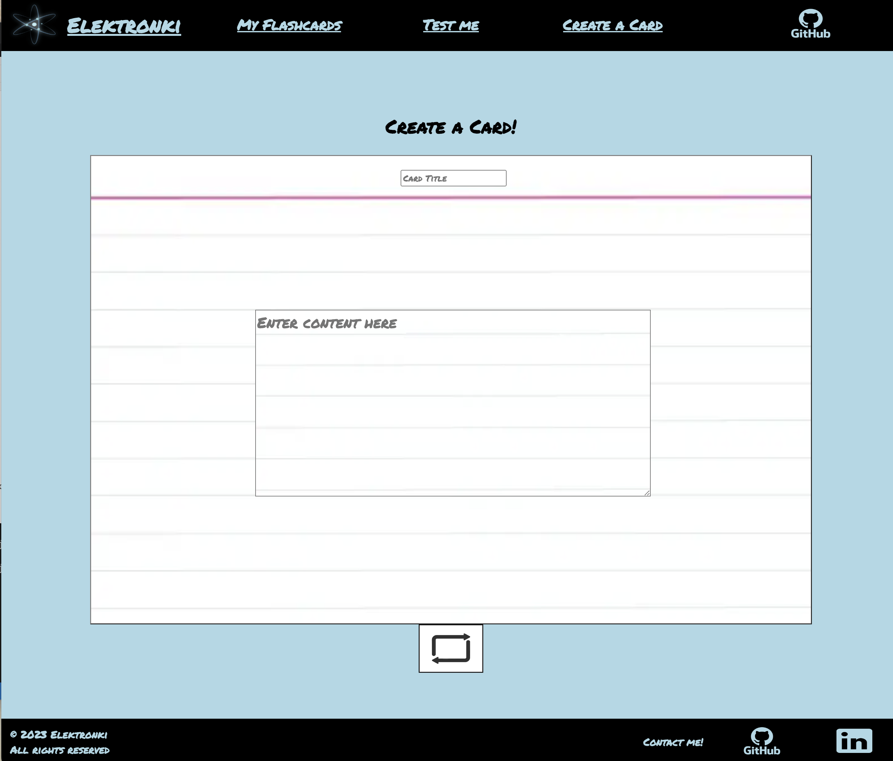

#  <p align="center"></p>

<br/>

## <p align="center"> Table of Contents </p>
- [About](#About)
- [Preview](#Preview)
- [Installation](#Installation)
- [Tech Stack](#Tech-Stack)
- [Upcoming Features](#Upcoming-Features)
- [License](#License)

<br/>

## <p align="center">About</p>

  Test yourself with Elektronki! 
  <br/>
<br/>
Create flashcards
  <br/>
Quiz yourself
  <br/>
Pass your next exam || interview!

<br/>

## <p align="center">Preview</p>

<p align="center">
  
</p>

<br/>

## <p align="center">Installation</p>


1. Fork Elektronki's repository

<br/>

2. Clone your forked repository & add your GitHub handle to the CLI

   ```sh
   git clone https://github.com/your-github-handle/Elektronki.git
   ```
   
3. Install NPM packages with this CLI

   ```sh
   npm install
   ```

4. Connect your Mongo database
<br/>
Create a '.env' file in the root directory & paste in your URI

    ```js
    MONGO_URI = 'YourMongoDbURI';
    ```

5. Start up the app via the CLI

   ```sh
   npm run app
   ```

<br/>

## <p align="center">Tech Stack</p>


 


<br/>


<br/>


<br/>


<br/>

## <p align="center">Upcoming Features</p>

Elektronki aims to be available across all platforms & devices

<br/>

## <p align="center">License </p>

Please feel free to reach out if you have any comments or concerns!

Upon contributing, you agree that your contributions will be licensed under its [MIT License](/LICENSE).
