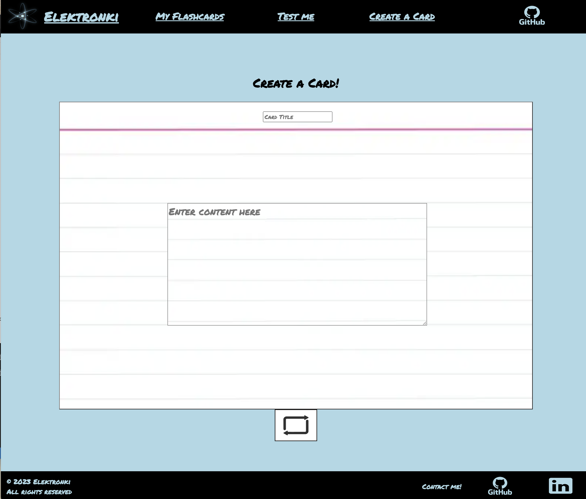

#  

 

## Table of Contents
- [About](#About)
- [Preview](#Preview)
- [Installation](#Installation)
- [Tech Stack](#Tech-Stack)
- [Upcoming Features](#Upcoming-Features)
- [License](#License)

 

## About

  Test yourself with Elektronki! 
   
 
Create flashcards
   
Quiz yourself
   
Pass your next exam || interview!

 

## Preview

  

 

## 
Installation

 

## 
Tech Stack

 

 

## Upcoming Features

 

## License
